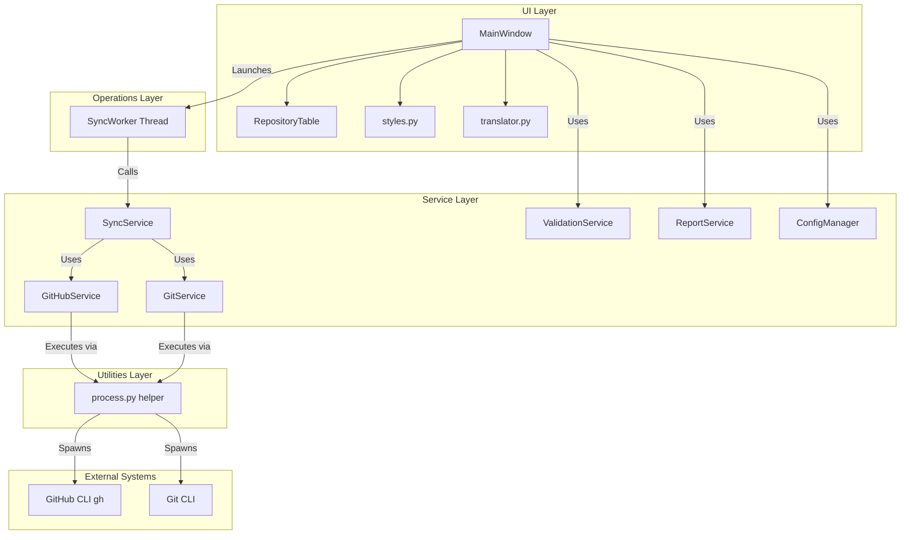

# Architecture Documentation - GitHub Organization Sync

This document describes the architectural design, layer boundaries, and internal systems of the `github-org-sync` application.

## High-Level Diagram

---

## 1. Central Subprocess Execution (`utils/process.py`)
To prevent command prompt console windows from flashing on Windows during synchronization, all subprocess invocations are routed through a central helper:
- **`run_process`** and **`popen_process`**: Wrappers for `subprocess.run` and `subprocess.Popen` that automatically append `creationflags=subprocess.CREATE_NO_WINDOW` (value `0x08000000`) if executing on the Windows platform.
- **Cross-platform Safety**: The `creationflags` argument is never set on Linux or macOS. Subprocess execution remains completely non-interactive (no `shell=True`) using structured list arguments.

## 2. Localization & Translation Engine (`i18n/`)
Version 1.1.0 introduces a real-time translation module:
- **Translations Schema (`i18n/translations.py`)**: A centralized nested dictionary containing comprehensive Polish (`pl`) and English (`en`) localized phrases for buttons, labels, check-boxes, tooltips, dialogs, warnings, and Git status states.
- **Translator Manager (`i18n/translator.py`)**: A singleton class managing active language state, persisting user selection in local configurations, and providing helper function `_t` to resolve translation keys. Retranslation takes place in real-time without restarting the application by calling `MainWindow.retranslate_ui()`.

## 3. Dynamic Stylesheet & Theme System (`ui/styles.py`)
Styling supports **System**, **Light**, and **Dark** themes:
- **Adaptive System Theme**: `is_system_dark()` queries PySide6 style hints color scheme API (`QGuiApplication.styleHints().colorScheme()`) with a fallback querying the Windows Registry (`AppsUseLightTheme` under `Themes\Personalize`) to dynamically render dark/light modes matching OS parameters.
- **QSS Stylesheets**: Dedicated, high-contrast Slate stylesheets for dark (`DARK_STYLESHEET`) and light (`LIGHT_STYLESHEET`) configurations.

## 4. UI Layer (`ui/`)
- **MainWindow (`ui/main_window.py`)**: Entry point of the GUI. Houses window position and column width persistence, setups hotkeys (`Ctrl+L`, `Ctrl+R`, etc.), and manages the GUI State Machine.
- **RepositoryTable (`ui/repository_table.py`)**: QTableWidget subclass. Manages row filtering by name and status, implements column sorting, and handles double-click folder opening and right-click context menus.
- **GUI State Machine**: Controls element accessibility across defined states:
  - `IDLE`: Inputs and synchronization actions are fully editable.
  - `LOADING_REPOSITORIES`: Querying GitHub CLI in background. Disables synchronization and configuration changes.
  - `INSPECTING_WORKSPACE`: Querying local repositories in thread. Disables synchronization. Allows cancellation.
  - `SYNCING`: Actively cloning and updating. Disables configurations and directories adjustments. Allows cancellation.
  - `CANCELLING`: Cancellation request submitted, waiting for current worker loop iteration to stop.

## 5. Operations & Worker Lifecycle (`workers/` & `services/`)
- **Worker Execution (`workers/sync_worker.py`)**: Threaded operations running in `QThread` to prevent freezing the GUI.
- **Cooperative Cancellation**: Standard cooperative checking. `SyncService.check_local_statuses` and `SyncService.sync_repositories` accept an `is_cancelled_callback` checked between repository loops to terminate cleanly.
- **Race Condition Prevention**:
  - Direct helper `_cancel_active_worker()` terminates any running thread before a new one is spawned.
  - Modifying the Workspace path instantly invalidates local status entries in the table, resetting values to `MISSING` and stopping active inspections to prevent writing stale status results to a newly selected workspace.
