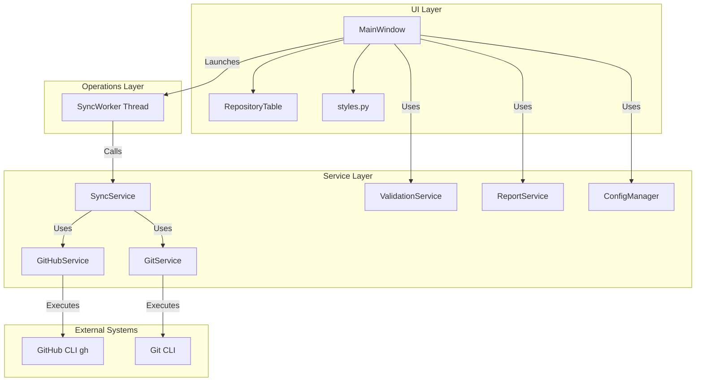

# Architecture Documentation - GitHub Organization Sync

This document describes the architectural design and boundaries of responsibility for the `github-org-sync` application.

## High-Level Diagram

---

## 1. GUI Layer (`ui/`)
- **MainWindow (`ui/main_window.py`)**: The visual entry point. Orchestrates the layouts, options check-boxes, signals from/to worker threads, config loading/saving, and reports trigger.
- **RepositoryTable (`ui/repository_table.py`)**: Custom table widget extending `QTableWidget` to represent repository data (visibility, archived status, checked states, operation actions) and applying consistent soft-status color highlights.
- **Styles (`ui/styles.py`)**: Holds the application CSS theme. Provides high-fidelity aesthetics with slate/blue/violet colors, focus rings, hover transitions, and progress bar style.

## 2. Operations Layer (`workers/`)
- **SyncWorker (`workers/sync_worker.py`)**: Runs asynchronously by inheriting from `QThread`. Prevents blocking/freezing the Qt GUI main thread. Utilizes Qt Signals (`progress_updated`, `log_emitted`, `finished`, `error_occurred`) to securely update GUI states. Supports safe cooperative cancellation via an internal flag.

## 3. Service Layer (`services/`)
- **SyncService (`services/sync_service.py`)**: High-level workflow orchestrator. Handles filtering lists of repositories, updating local directory mappings, checking local state directories, and sequencing execution queues.
- **GitHubService (`services/github_service.py`)**: Encapsulates all interface operations with the GitHub CLI (`gh`). Performs version checking, authentication status queries, and repository list fetching.
- **GitService (`services/git_service.py`)**: Core Git command engine. Checks repository states, extracts tracking branch ahead/behind values, handles safe non-destructive pulls (`--ff-only`), and executes safe autostash operations.
- **ValidationService (`services/validation_service.py`)**: Handles normalizing inputs (converting SSH and HTTPS org URLs to organization names) and validates path properties.
- **ReportService (`services/report_service.py`)**: Handles formatting and writing JSON and Markdown report summaries to the application data directory.

## 4. Models (`models/`)
- **Repository (`models/repository.py`)**: Simple dataclass containing Git and GitHub repository state metadata.
- **SyncResult (`models/sync_result.py`)**: Dataclass modeling the outcome of a single repository sync execution.
- **Organization (`models/organization.py`)**: Simple dataclass storing organization details.

---

## Boundaries of Responsibility
- **No Direct Subprocess in UI**: The UI classes MUST NEVER call subprocesses directly. All system calls go through `GitService` or `GitHubService` and must be executed in background worker threads.
- **No Force Operations**: Under no circumstances should GitService run force pushes, cleanings, rebases, or checkouts that could lead to user data loss.
- **Secrets Isolation**: No OAuth tokens or credentials should be logged, written to files, or stored in code. Authentication is delegated entirely to the external `gh` CLI.
